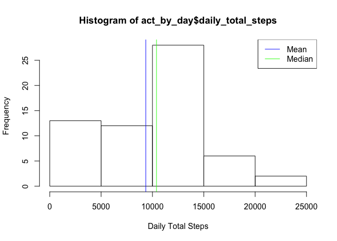
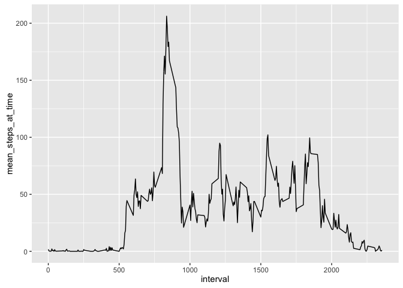
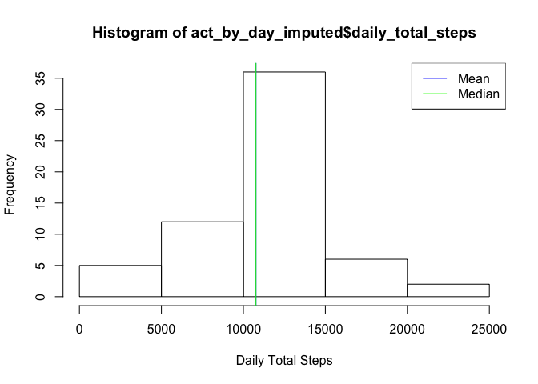
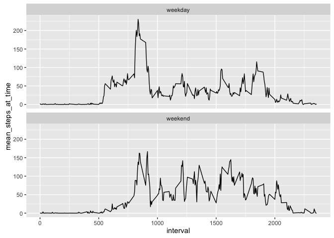

# Reproducible Research: Peer Assessment 1


```r
library(readr)
library(dplyr)
```

```
## 
## Attaching package: 'dplyr'
```

```
## The following objects are masked from 'package:stats':
## 
##     filter, lag
```

```
## The following objects are masked from 'package:base':
## 
##     intersect, setdiff, setequal, union
```

```r
library(ggplot2)
```

## Loading and preprocessing the data


```r
## Loading and preprocessing the data
file_path <- unzip("activity.zip")
act <- read_csv(file_path)
# dates are properly read in by readr as Date 
```


## What is mean total number of steps taken per day?

```r
act_by_day <- act %>%
  group_by(date) %>%
  summarize(daily_total_steps = sum(steps, na.rm = TRUE)) 

hist(act_by_day$daily_total_steps, xlab = "Daily Total Steps")
dts.m <- mean(  act_by_day$daily_total_steps, na.rm = TRUE)
dts.d <- median(act_by_day$daily_total_steps, na.rm = TRUE)
abline(v = dts.m, col = "blue")
abline(v = dts.d, col = "green")
legend("topright", c("Mean", "Median"), col = c("blue", "green"), lty = 1)
```




## What is the average daily activity pattern?

```r
act_by_time <- act %>%
  group_by(interval) %>%
  summarize(mean_steps_at_time = mean(steps, na.rm = TRUE)) 

ggplot(act_by_time, aes(x= interval, y = mean_steps_at_time)) +
  geom_line()
```



```r
# Q: Which 5-minute interval, on average across all the days in the dataset, contains the maximum number of steps? 
# A: The interval beginning at: 
with(act_by_time, interval[which.max(mean_steps_at_time)])
```

```
## [1] 835
```


## Imputing missing values

```r
# The total number of rows with an NA in the dataset: 
sum(!complete.cases(act))
```

```
## [1] 2304
```

```r
lapply(act, function(x) sum(is.na(x)))
```

```
## $steps
## [1] 2304
## 
## $date
## [1] 0
## 
## $interval
## [1] 0
```

```r
# all the NAs are only in the "steps" column

# As the question suggests, impute NAs with with the mean for that 5-minute interval
act_with_imputedNAs <- act %>%
  group_by(interval) %>%
  mutate(mean_steps_at_time = mean(steps, na.rm = TRUE),
         steps = ifelse(is.na(steps), mean_steps_at_time, steps)) %>%
  select(-mean_steps_at_time)


act_by_day_imputed <- act_with_imputedNAs %>%
  group_by(date) %>%
  summarize(daily_total_steps = sum(steps, na.rm = TRUE)) 


hist(act_by_day_imputed$daily_total_steps, xlab = "Daily Total Steps")
dts.m.imp <- mean(  act_by_day_imputed$daily_total_steps)
dts.d.imp <- median(act_by_day_imputed$daily_total_steps)
abline(v = dts.m.imp, col = "blue")
abline(v = dts.d.imp, col = "green")
legend("topright", c("Mean", "Median"), col = c("blue", "green"), lty = 1)
```



```r
# unsurprisingly, there is a difference on mean and median of daily total steps. It appears that teh imputation leads to an higher estimate of both mean and median, by 1412 and 371 steps, respectively.
dts.m.imp - dts.m
```

```
## [1] 1411.959
```

```r
dts.d.imp - dts.d
```

```
## [1] 371.1887
```


## Are there differences in activity patterns between weekdays and weekends?

```r
by_weekday <- act_with_imputedNAs %>%
  mutate(day = weekdays(date))

by_weekday <- within(by_weekday, {
  day[day %in% c("Saturday", "Sunday")] <- "weekend"
  day[day != "weekend"] <- "weekday"
  day <- factor(day)
  })

act_by_weekday_and_time <- by_weekday %>%
  group_by(interval, day) %>%
  summarize(mean_steps_at_time = mean(steps) )

ggplot(act_by_weekday_and_time, 
       aes(x= interval, y = mean_steps_at_time)) +  
  geom_line() + facet_wrap(~day, ncol = 1)
```




